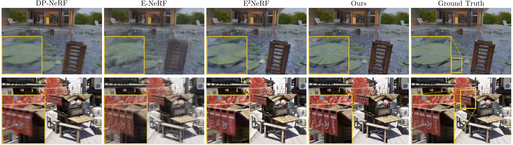

# Mitigating Motion Blur in Neural Radiance Fields with Events and Frames

<p align="center">
  <a href="https://www.youtube.com/watch?v=5CuM2108R6E">
    
  </a>
</p>


This is the official Pytorch implementation of the **CVPR 2024** paper\
[Mitigating Motion Blur in Neural Radiance Fields with Events and Frames](https://rpg.ifi.uzh.ch/docs/CVPR24_Cannici.pdf).

## Citation
A pdf of the paper is available [here](https://rpg.ifi.uzh.ch/docs/CVPR24_Cannici.pdf). If you use this codebase, or the datasets accompanying the paper, please cite the publication as follows:

```bibtex
@InProceedings{Cannici_2024_CVPR,
  author  = {Marco Cannici and Davide Scaramuzza},
  title   = {Mitigating Motion Blur in Neural Radiance Fields with Events and Frames},
  booktitle = {Proceedings of the IEEE/CVF Conference on Computer Vision and Pattern Recognition (CVPR)},
  year    = {2024},
}
```

## Method Overview


We propose a novel approach for recovering a sharp NeRF in the presence of motion blur, incorporating both model-based
priors and learning-based modules, and exploiting the complementary information provided by events and frames. We 
exploit the event double integral as an additional model-based prior and model the event-pixel response using an 
end-to-end learnable response function, allowing our method to adapt to non-idealities in the real event-camera sensor.



## Project Overview

### 1. Install conda environment

We highly recommend using [Mambaforge](https://github.com/conda-forge/miniforge#mambaforge) to reduce the 
installation time.  In such case, replace `conda` with `mamba` in the following command:

```bash
conda env create -f environment.yml
```

<details>
<summary> Dependencies (click to expand) </summary>

```
- python=3.8
- pytorch-cuda=11.6
- pytorch==1.13.1
- torchvision==0.14.1
- configargparse=1.5.3
- einops=0.7.0
- imageio=2.22.0
- kornia=0.6.9
- numba=0.56.4
- numpy=1.23.1
- pandas=2.0.3
- plotly=5.18.0
- scikit-image=0.19.2
- scipy=1.9.1
- tqdm=4.65.0
- h5py=3.8.0
- pillow=9.2.0
- pyyaml=6.0
- open3d=0.15.1
- imageio-ffmpeg>=0.4.9
- matplotlib>=3.7.3
- opencv-python==4.6.0.66
- tensorboardx>=2.5.1
```    

</details>

### 2. Download datasets

Download the 
[Ev-DeblurNeRF-CDAVIS](https://download.ifi.uzh.ch/rpg/web/data/cvpr24_evdeblurnerf/evdeblurnerf_cdavis.zip) and
[Ev-DeblurNeRF-Blender](https://download.ifi.uzh.ch/rpg/web/data/cvpr24_evdeblurnerf/evdeblurnerf_blender.zip)
datasets and place them in the `datasets/` folder.

The dataset is provided in LLFF format. Please refer to the original 
[LLFF codebase](https://github.com/Fyusion/LLFF?tab=readme-ov-file#using-your-own-poses-without-running-colmap) 
for a more detailed description of camera poses format.

<details>
<summary>Folder structure (click to expand)</summary>

```
datasets/
├─ evdeblurnerf_cdavis/
│  ├─ blurbatteries/
│  │  ├─ images_1/            ◁─┬ Interleaved blur and sharp images, see llffhold and 
│  │  │  ├─ 00.png              └ llffhold_end args. Images are already undistorted.
│  │  │  ├─ 01.png
│  │  │  ├─ ...
│  │  │  └─ timestamps.npz    ◁─┬ Image timestamps in npz format with keys (timestamps, 
│  │  │                         │ timestamps_start, timestamps_end, start, end). Timestamps
│  │  │                         │ are either in us or ns, see events_tms_files_unit arg. Sharp
│  │  │                         └ images are indicated with timestamps_start = timestamps_end.
│  │  ├─ poses_bounds.npy     ◁── Camera poses in LLFF format.
│  │  ├─ events.h5            ◁─┬ Events saved in HDF5 file format with (p, t, x, y) keys. 
│  │  │                         └ Timestamps are either in us or ns, see events_tms_unit arg.
│  │  ├─ ev_map.npz           ◁─┬ Mapping between original image and undistorted space (used 
│  │  │                         └ with color events only, not available in Blender dataset).
│  │  ├─ all_poses_bounds.npy ◁── All available poses for interpolation in LLFF format.
│  │  └─ all_timestamps.npy   ◁── All available timestamps for interpolation.
│  └─ ... 
└─ evdeblurnerf_blender/
   └─ ...
```

</details>


### 3. Setting parameters

We provide `ConfigArgparse` config files for the main experiments in the paper in the `configs/` folder.
You might want to modify the `datadir` parameter in the config file if you decided to store the datasets in a custom
folder, and the `basedir` and `tbdir` parameters to change where the model will be saved and the tensorboard logs will 
be stored, respectively.

Note: Tensorboard logs are disabled by default in place of W&B logging. You can enable tensorboard logs by
setting `--use_tensorboard`, and disable W&B logging by using the `--no_wandb` parameter.

### 4. Execute

```
python run_nerf.py --config configs/evdeblurnerf_blender/tx_blurfactory_evdeblurnerf_ediprior_evcrf.txt
```

This command will train a model using the parameters specified in the config file. Video and test set renderings will be
produced at the end of training, or every `i_testset` and `i_video` iterations, respectively.

## Acknowledgments
This source code is derived from multiple sources, in particular: 
[PDRF](https://github.com/cpeng93/PDRF), 
[DP-NeRF](https://github.com/dogyoonlee/DP-NeRF),
and [TensoRF](https://github.com/apchenstu/TensoRF).
We thank the authors for releasing their code. 
